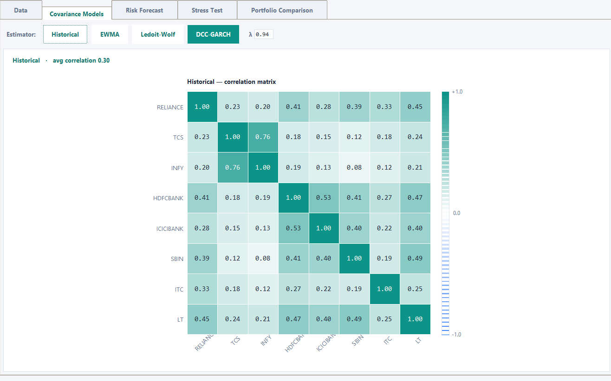
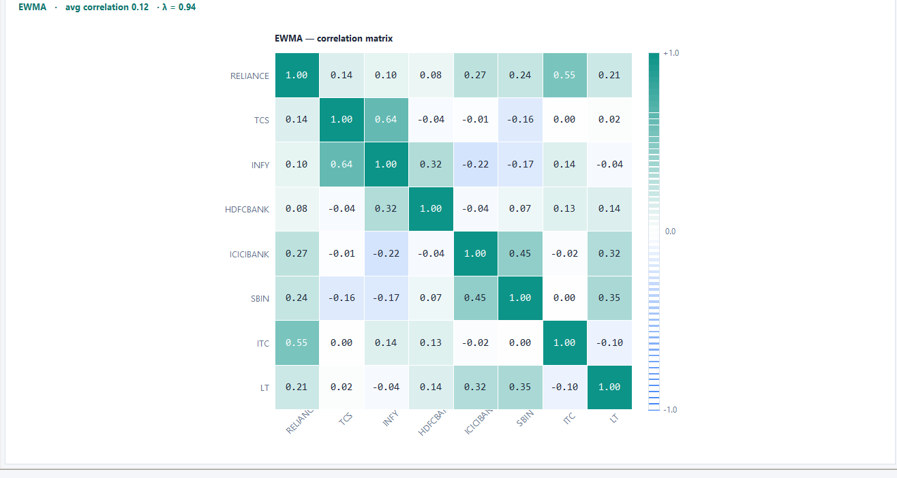
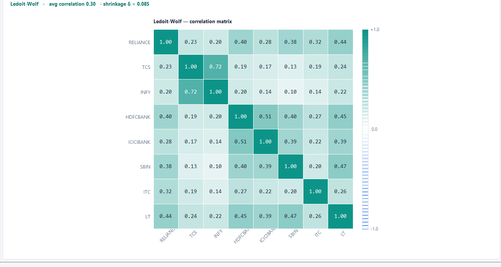
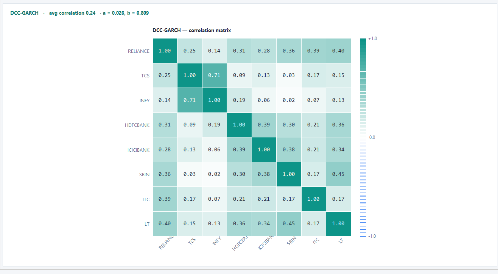
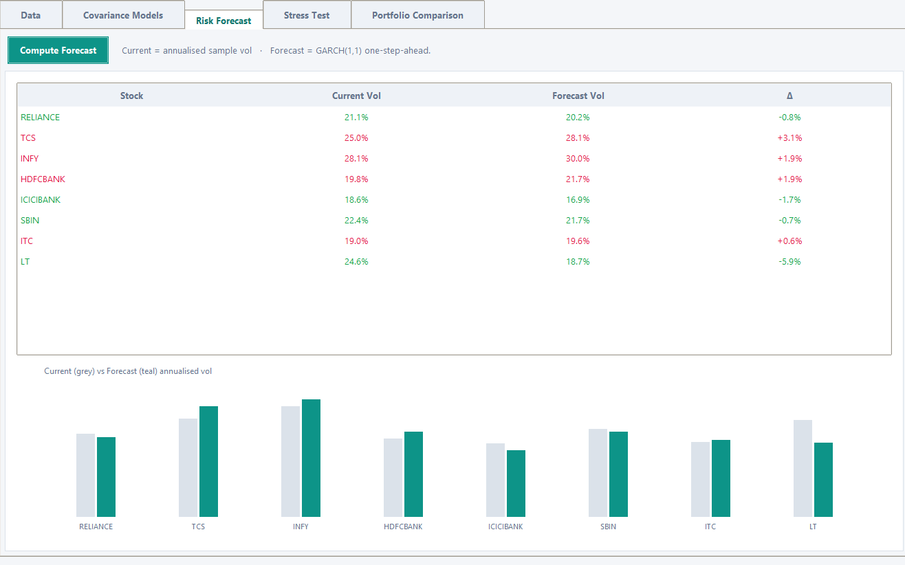
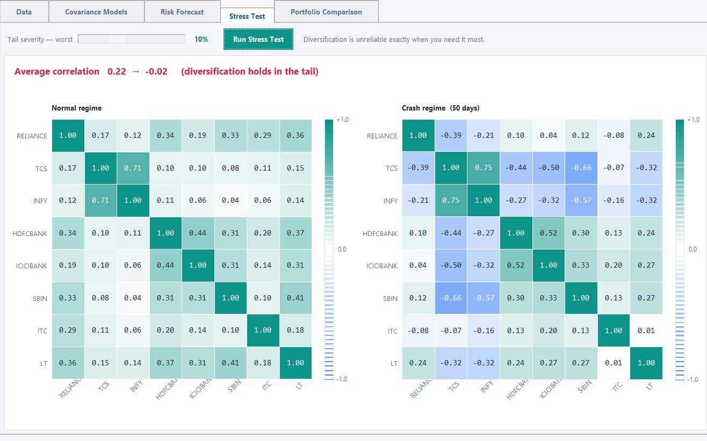
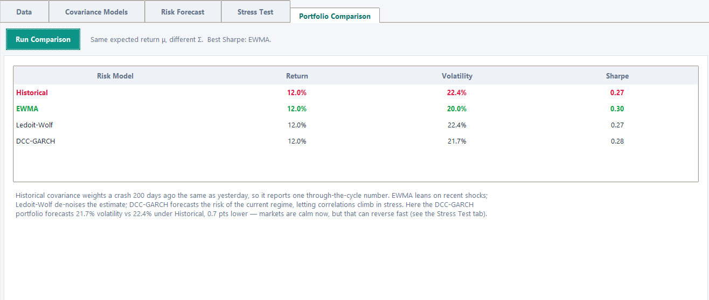

# Covariance Risk Forecasting Engine

A Python research project for estimating, forecasting and comparing portfolio covariance using Historical, EWMA, Ledoit-Wolf and DCC-GARCH models.

The project studies a practical portfolio question: **how does the choice of covariance estimator change measured risk and the portfolio selected by a mean-variance optimizer?** It combines covariance heatmaps, one-step-ahead GARCH volatility forecasts, regime-conditioned stress analysis and a controlled portfolio comparison.

## Research workflow

1. Align prices and calculate log returns.
2. Estimate four annualized covariance matrices.
3. Convert each matrix into correlations for visual inspection.
4. Forecast asset volatility with GARCH(1,1).
5. Compare normal-market and left-tail correlations.
6. Hold expected returns constant and optimize under each risk model.
7. Compare model-implied volatility and Sharpe ratios.

## Models

| Model | Purpose | Main strength | Main limitation |
|---|---|---|---|
| Historical | Equal-weighted sample covariance | Transparent baseline | Slow to react |
| EWMA | Exponentially weighted covariance | Responds to recent observations | Sensitive to decay choice |
| Ledoit-Wolf | Shrink noisy covariance toward a stable target | Stable and well-conditioned | Not explicitly dynamic |
| DCC-GARCH | Forecast volatility and correlation jointly | Regime-sensitive risk forecast | Computationally intensive |

## Screenshots

### Historical covariance



### EWMA covariance



### Ledoit-Wolf covariance



### DCC-GARCH covariance



### GARCH volatility forecast



### Stress correlations



### Portfolio comparison



## Repository structure

```text
covariance-risk-engine/
├── assets/screenshots/       # Cropped and stitched research outputs
├── docs/                     # Research report
├── outputs/                  # Generated model rankings
├── src/covariance_engine.py  # Reusable quantitative logic
├── tests/test_engine.py      # Numerical and structural checks
├── main.py                   # Command-line demonstration
├── requirements.txt
└── pyproject.toml
```

## Installation

```bash
git clone https://github.com/your-username/covariance-risk-engine.git
cd covariance-risk-engine
python -m venv .venv
```

Activate the environment and install the project:

```bash
pip install -e .
```

## Run

Use the reproducible demonstration dataset:

```bash
python main.py
```

Or provide a CSV whose first column contains dates and remaining columns contain prices:

```bash
python main.py --prices data/prices.csv --output outputs/model_comparison.csv
```

## Tests

```bash
pytest
```

## Interpreting the output

The highest displayed Sharpe ratio is the **highest model-implied Sharpe for that run**. It is not proof that the estimator will perform best in the future. A production model-selection decision should use rolling out-of-sample covariance loss, realized volatility, turnover and transaction costs.

The stress module reports both signed and absolute average correlations. This prevents positive and negative correlations from cancelling and hiding strong tail dependence.

## Research findings from the illustrated run

- Historical average correlation was 0.30.
- EWMA average correlation was 0.12, indicating weaker recent co-movement.
- Ledoit-Wolf used a shrinkage intensity of 0.085 and remained close to the historical matrix.
- DCC-GARCH produced an average forecast correlation of 0.24 with stable parameters `a = 0.026` and `b = 0.809`.
- EWMA produced the lowest model-implied portfolio volatility and the highest displayed Sharpe ratio.
- The tail test produced offsetting positive and negative relationships, showing why signed average correlation alone is insufficient.

## Scope

This repository is a research and educational implementation. It is not investment advice and does not promise future performance.

## License

MIT License.
